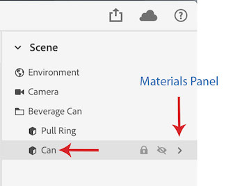
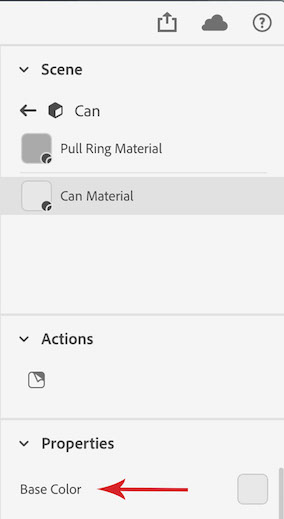

## Material variation Example

<a href="Properties.md" >Properties Definitions</a>

| Name | Screen Shots |
| ---- | ------------ |
| `Scene` |  |
| `Scene/Beverage Can` |  |
| `Scene/Beverage Can/Can` |  |
| `Scene/Beverage Can/Can/Materials` |  |
| `Scene/Beverage Can/Can/Materials/Can Material` |  |
| `Scene/Beverage Can/Can/Materials/Can Material/Base-Color` |  |

```
{
  "input": "https://signed-url-GET-base-dn-file....",
  "name": "test-variation",
  "engine_type": "lantern",
  "variations": [
    {
      "render_settings": {
        "name": "test-variation-name",
        "properties": [
          {
            "name": "setPropertyValue",
            "property": "Scene/Beverage Can/Can/Materials/Can Material/Base Color",
            "value": {
              "type": "image",
              "file": "https://signed-url-GET-variation-image..."
            }
          }
        ],
        "return_url": "https://signed-url-PUT-for-render-result...",
        "preset": "preset-low",
        "outputs": [
          {
            "pixel_depth": 16,
            "output_format": "psd"
          }
        ]
      }
    }
  ]
}
```
